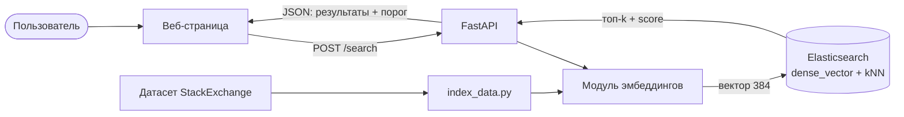
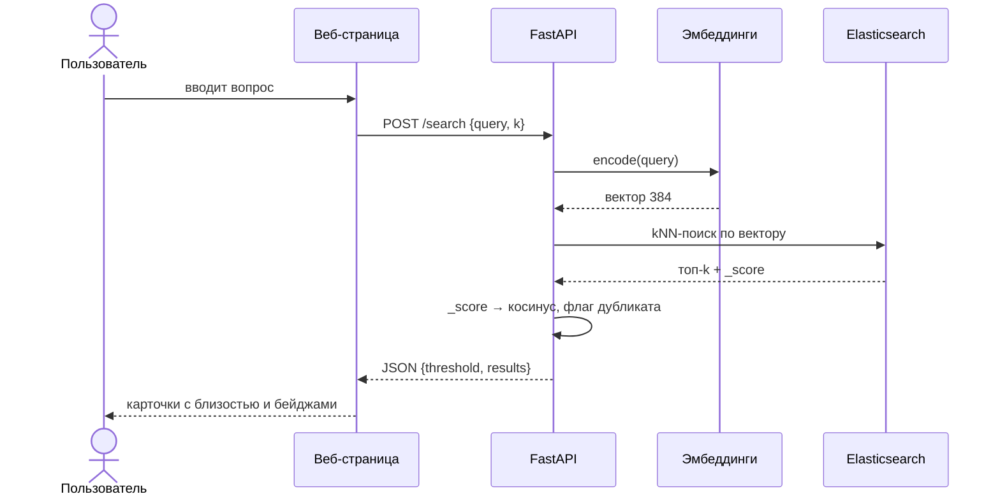

# Поиск дубликатов вопросов StackExchange


Система определения **дубликатов вопросов по смыслу**. Находит семантически похожие
вопросы с помощью эмбеддингов `sentence-transformers` и быстрого kNN-поиска в
Elasticsearch, помечает вероятные дубликаты по порогу близости и предоставляет
веб-интерфейс и REST API для тестирования.

> Курсовая работа по дисциплине «Методы и технологии программирования», вариант 26.
> Предметная область — обработка естественного языка (NLP).

---

## Содержание

- [Зачем это нужно](#зачем-это-нужно)
- [Как это работает](#как-это-работает)
- [Технологический стек](#технологический-стек)
- [Быстрый старт (Docker)](#быстрый-старт-docker)
- [Локальный запуск](#локальный-запуск)
- [Индексация данных](#индексация-данных)
- [REST API](#rest-api)
- [Конфигурация](#конфигурация)
- [Тестирование](#тестирование)
- [Безопасность](#безопасность)
- [Качество и производительность](#качество-и-производительность)
- [Структура проекта](#структура-проекта)
- [Ограничения и развитие](#ограничения-и-развитие)

---

## Зачем это нужно

На платформах вопросов и ответов (StackOverflow, сеть Stack Exchange) огромная доля
вопросов — **дубликаты**: одно и то же спрашивают разными словами. Это дробит ответы по
множеству страниц и затрудняет поиск готового решения.

Обычный поиск по ключевым словам тут бессилен: два вопроса об одном и том же могут не
иметь **ни одного общего слова**. Пример из реальной выдачи системы:

| Запрос | Найденный дубликат | Близость |
|--------|--------------------|----------|
| `invert the order of characters in a string` | `Best way to reverse a string` | 67 % |
| `how do I get rid of repeated items` | `Removing duplicates from a list` | — |

Ни «invert/order/characters» против «reverse/string» не совпадают по словам — а система
находит, потому что сравнивает **смысл**, а не текст.

## Как это работает

Каждый вопрос превращается в вектор (эмбеддинг) размерности 384 одной и той же моделью.
Близким по смыслу вопросам соответствуют близкие векторы; близость измеряется косинусной
мерой. Elasticsearch хранит векторы и быстро находит ближайшие (приближённый kNN, HNSW).



Поиск одного запроса по шагам:



## Технологический стек

| Слой | Технология | Роль |
|------|------------|------|
| Эмбеддинги | sentence-transformers (`all-MiniLM-L6-v2`) | текст → вектор 384 |
| Хранилище и поиск | Elasticsearch 8.15 (`dense_vector`, kNN) | хранение векторов, поиск по близости |
| Веб / API | FastAPI + Uvicorn | REST API и веб-страница |
| Валидация | Pydantic | схемы запроса/ответа |
| Контейнеризация | Docker + Docker Compose | развёртывание всего стека |
| Качество | pytest, bandit, pip-audit | тесты и анализ безопасности |
| CI/CD | GitHub Actions | автозапуск bandit + pytest |

## Быстрый старт (Docker)

```bash
docker compose up --build
```

Поднимутся два контейнера — приложение и Elasticsearch. После старта:

- Веб-интерфейс — http://localhost:8000/
- Документация API (Swagger) — http://localhost:8000/docs

Перед первым поиском нужно один раз [проиндексировать данные](#индексация-данных).

## Локальный запуск

```bash
python -m venv .venv
# Windows:        .\.venv\Scripts\Activate.ps1
# Linux / macOS:  source .venv/bin/activate
pip install -r requirements.txt

docker compose up -d elasticsearch   # только Elasticsearch
python scripts/index_data.py          # индексация (один раз)
uvicorn app.api:app --reload          # сервер на http://localhost:8000
```

> В Docker-образе ставится **CPU-сборка PyTorch**, чтобы не тянуть многогигабайтные
> CUDA-библиотеки (инференс идёт на CPU).

## Индексация данных

```bash
python scripts/index_data.py
```

Загружает первые `MAX_PAIRS` пар из датасета
`sentence-transformers/stackexchange-duplicates`, считает эмбеддинги и кладёт уникальные
вопросы в индекс `so_questions` (~19 000 вопросов при 10 000 парах).

Вспомогательные сценарии:

| Сценарий | Назначение |
|----------|------------|
| `scripts/explore_data.py` | предпросмотр датасета |
| `scripts/index_data.py` | индексация в Elasticsearch |
| `scripts/search_cli.py` | поиск из командной строки |
| `scripts/evaluate.py` | метрики качества (Recall@k, MRR) |
| `scripts/benchmark.py` | замер латентности поиска |

## REST API

| Метод | Путь | Описание |
|-------|------|----------|
| `GET` | `/` | веб-страница поиска |
| `GET` | `/health` | проверка состояния (доступен ли Elasticsearch) |
| `POST` | `/search` | поиск похожих вопросов |
| `GET` | `/docs` | интерактивная документация (Swagger UI) |

Пример запроса:

```http
POST /search
Content-Type: application/json

{ "query": "how to read a file in python", "k": 5 }
```

Пример ответа:

```json
{
  "query": "how to read a file in python",
  "threshold": 0.8,
  "results": [
    { "question": "Read a list from a file in python", "score": 0.84, "is_duplicate": true },
    { "question": "Read a text file and save value as variable", "score": 0.74, "is_duplicate": false }
  ]
}
```

## Конфигурация

Настройки задаются в `app/config.py` (через `pydantic-settings`) и переопределяются
переменными окружения или файлом `.env`:

| Параметр | По умолчанию | Описание |
|----------|--------------|----------|
| `elasticsearch_url` | `http://localhost:9200` | адрес Elasticsearch |
| `index_name` | `so_questions` | имя индекса |
| `embedding_model` | `all-MiniLM-L6-v2` | модель эмбеддингов |
| `embedding_dim` | `384` | размерность вектора |
| `similarity_threshold` | `0.8` | порог отнесения к дубликатам |

В Docker `ELASTICSEARCH_URL` указывает на сервис `elasticsearch` внутри сети Compose.

## Тестирование

```bash
pytest -v
```

15 тестов: модульные (настройки, схемы, эмбеддинги — размерность, нормализация,
семантическая близость) и интеграционные (индексация и поиск во временном индексе, API).
Интеграционные тесты автоматически пропускаются, если Elasticsearch недоступен.

## Безопасность

```bash
bandit -r app scripts   # статический анализ кода (SAST)
pip-audit               # проверка зависимостей (SCA)
```

Результаты: bandit — `No issues identified` (замечания разобраны и обоснованы);
pip-audit — уязвимости `pip` устранены обновлением, по `transformers` риск принят с
обоснованием. Отчёты: `docs/bandit-report.txt`, `docs/pip-audit-report.md`.

## Качество и производительность

Оценка на 300 размеченных парах дубликатов:

| Метрика | Значение | Что означает |
|---------|----------|--------------|
| Recall@1 | 0.51 | дубликат на 1-м месте выдачи |
| Recall@5 | 0.67 | дубликат в топ-5 |
| Recall@10 | 0.74 | дубликат в топ-10 |
| MRR | 0.58 | средняя обратная позиция дубликата |

Производительность поиска (CPU):

| Показатель | Значение |
|------------|----------|
| Средняя латентность | ~37 мс |
| Медиана | ~37 мс |
| p95 | ~48 мс |
| Пропускная способность | ~27 запросов/с |

## Структура проекта

```
so-dup-finder/
├── app/                  # приложение
│   ├── config.py         # настройки (pydantic-settings)
│   ├── embeddings.py     # текст → нормализованный вектор
│   ├── search.py         # индекс и kNN-поиск в Elasticsearch
│   ├── schemas.py        # схемы запроса/ответа API
│   └── api.py            # FastAPI: /, /health, /search
├── web/
│   └── index.html        # веб-страница поиска
├── scripts/              # индексация, оценка, бенчмарк, демо
├── tests/                # тесты pytest
├── docs/                 # диаграммы и отчёты безопасности
├── .github/workflows/    # CI (GitHub Actions)
├── Dockerfile
├── docker-compose.yml
└── requirements.txt
```

## Ограничения и развитие

- Датасет содержит только **заголовки** вопросов (без ссылок и ответов), поэтому
  результаты не ведут на внешние страницы — реализована основная, содержательная часть:
  семантическое сопоставление.
- Качество ограничено краткостью заголовков и шумом в разметке датасета.

**Перспективы:** использование полного текста вопроса; более крупная или многоязычная
модель; подбор порога по данным (точность/полнота); связывание результатов с реальными
страницами вопросов при наличии ссылок.